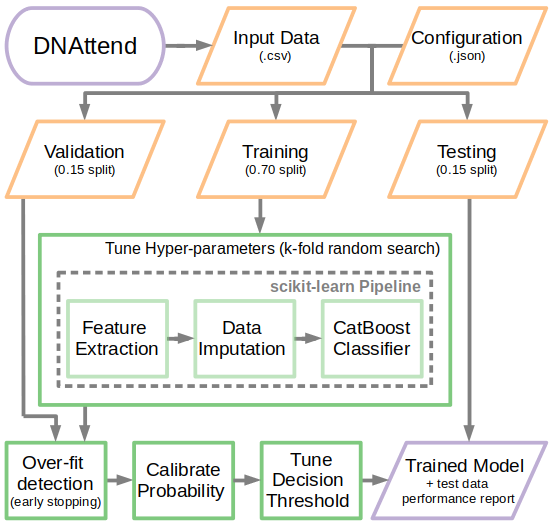

# DNAttend - ML framework for predicting patient non-attendance

## Train, test and validate a CatBoost Classifier for predicting patient non-attendance (DNA)

[](https://github.com/GIScience/badges#experimental)


## Table of contents

  * [Installation](#installation)
   * [Virtual Environment](#virtual-environment)
      * [Unix/macOS](#unixmacos)
      * [Windows](#windows)
    * [Docker](#docker)
  * [Workflow](#workflow)
  * [Usage](#usage)
    * [Generate Example Data](#generate-example-data)
    * [Train Model](#train-model)
    * [Evaluate Model](#evaluate-model)
    * [Refit Model with All Data](#refit-model-with-all-data)
    * [Generate Predictions](#generate-predictions)
  * [Contributing](#contributing)
  * [License](#license)
  * [Contact](#contact)


## Installation
Installation is possible via `pip` as shown below.
To manage dependencies and avoid conflicts it is recommended to install within a [virtual environment](#virtual-environment) or a [Docker container](#docker) as described.

```bash
pip install git+https://github.com/nhsx/dna-risk-predict.git
```


### Virtual Environment

#### Unix/macOS
Run the following commands via Terminal.

```bash
python -m venv dnattend
source dnattend/bin/activate
pip install git+https://github.com/nhsx/dna-risk-predict.git
```

#### Windows
Run the following commands via PowerShell.

```PowerShell
py -m venv dnattend
dnattend/Scripts/Activate.ps1
pip install git+https://github.com/nhsx/dna-risk-predict.git
```

If running scripts is disabled on your system then run the following command before activating your environment.

```PowerShell
Set-ExecutionPolicy -ExecutionPolicy RemoteSigned -Scope CurrentUser
```


### Docker

```bash
git clone --depth 1 https://github.com/nhsx/dna-risk-predict.git
docker build -t dnattend .
docker run dnattend --help
```

To run the following example via Docker we recommended using docker volumes to access local data from the docker container.
The following command mounts the current directory to the directory `/out` within the container.
Following this we update the container working directory (`-w /out`) and run the commands as normal.

```bash
docker run -v $(pwd):/out -w /out \
  dnattend process config.yaml
```


## Worklow


 <br> *Overview of DNAttend workflow*


### Generate Example Data
The ```simulate``` sub-command generates suitably formatted input data for testing functionality.
It also writes an example config file in YAML format.

```bash
dnattend simulate --config config.yaml > DNAttend-example.csv
```

### Train Model

```bash
dnattend train config.yaml
```

### Evaluate Model

```bash
dnattend test config.yaml
```

### Refit Model with All Data
Following parameterisation, decision threshold tuning and validation the `retrain` module can be used to refit a new model on the whole data set.

```bash
dnattend retrain config.yaml
```

### Generate Predictions
The trained model is now ready to be used.
Predictions should be made with the `predict` module - this ensures the tuned decision threshold is correctly applied when assigning classes.
The output of `predict` includes the decision class (i.e.`Attend` and `DNA`) and the underlying probabilities of theses classes.
The output results of this example can be found [here](./README_files/example-data-predictions.csv)

```bash
dnattend predict --verify DNAttend-example.csv catboost-final.pkl > FinalPredictions.csv
```

### Contributing

Contributions are what make the open source community such an amazing place to learn, inspire, and create. Any contributions you make are **greatly appreciated**.

1. Fork the Project
2. Create your Feature Branch (`git checkout -b feature/AmazingFeature`)
3. Commit your Changes (`git commit -m 'Add some AmazingFeature'`)
4. Push to the Branch (`git push origin feature/AmazingFeature`)
5. Open a Pull Request

### License

Distributed under the MIT License. _See [LICENSE](./LICENSE) for more information._

### Contact

If you have any other questions please contact the author **[Stephen Richer](https://www.linkedin.com/in/stephenricher/)**
at stephen.richer@proton.me
