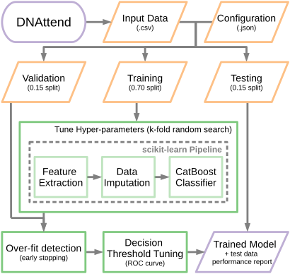
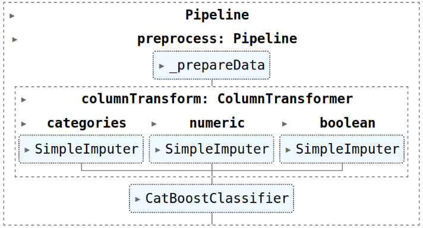
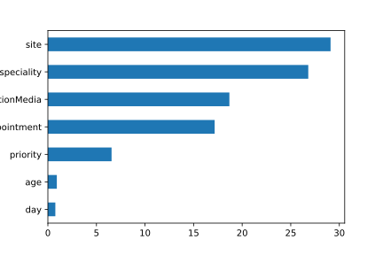
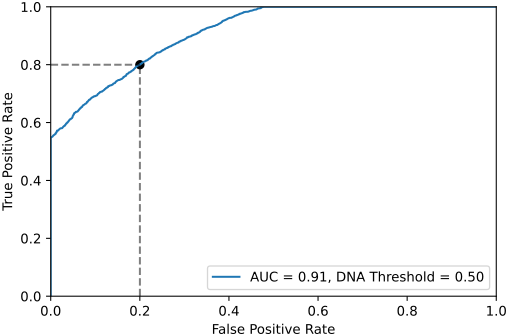

# DNAttend - ML framework for predicting patient non-attendance

## Train, test and validate a CatBoost Classifier for predicting patient non-attendance (DNA)

## Table of contents

  * [Installation](#installation)
  * [Workflow](#workflow)
  * [Usage](#usage)
    * [Generate Example Data](#generate-example-data)
    * [Split Data (Test, Train, Validation)](#split-data-test-train-validation)
    * [Train Model](#train-model)

## Installation

```bash
pip install git+https://github.com/nhsx/dna-risk-predict.git
```

## Worklow



## Usage

```python
from scipy.stats import randint, uniform
from dnattend.data import generateData
from dnattend.train import trainModel, splitData, refitAllData
from dnattend.test import getFeatureImportance, plotROC, predict, evaluate
```

#### Generate Example Data

```python
# Randomly generate some artificial attendance data
df = generateData(size=50_000, seed=42)
```

#### Split Data (Test, Train, Validation)

```python
data = splitData(df, target='status', train_size=0.7, test_size=0.15, val_size=0.15)
```

#### Train Model

```python
catCols = ['day', 'priority', 'speciality', 'consultationMedia', 'site']
boolCols = ['firstAppointment']
numericCols = ['age']

trainingParams = ({
    'catCols':             catCols,
    'boolCols':            boolCols,
    'numericCols':         numericCols,
    'cvFolds':             5,
    'catboostIterations':  100,
    'hypertuneIterations': 5,
    'evalIterations':      10_000,
    'earlyStoppingRounds': 10,
    'seed':                42
})
```

```python
# Optional - define estimator hyper-parameter search space
hyperParams = ({
    'estimator__depth':           randint(4, 10),
    'estimator__l2_leaf_reg':     randint(2, 10),
    'estimator__random_strength': uniform.rvs(0, 10, size=100),
})
```

```python
model, params = trainModel(data, hyperParams=hyperParams, **trainingParams)
```



#### Evaluate Model

##### Feature Importance

```python
featureImportances = getFeatureImportance(model)
fig = featureImportances.plot.barh()
fig.figure.savefig('featureImportances.png')
```




##### ROC Curve

```python
fig, ax = plotROC(model, data)
fig.figure.savefig('ROCcurve.svg')
```




##### Evaluation Report

```python
report = evaluate(model, data)

print(report)
{
    'Attend': {
        'precision': 0.7905064969504111,
        'recall':    0.8069842988630211,
        'f1-score':  0.798660415271266,
        'support':   3694
    },
    'DNA': {
        'precision': 0.8088471849865951,
        'recall':    0.7924875229839768,
        'f1-score':  0.8005837866525143,
        'support':   3807
    },
    'accuracy':      0.7996267164378082,
    'macro avg': {
        'precision': 0.7996768409685031,
        'recall':    0.7997359109234989,
        'f1-score':  0.7996221009618901,
        'support':   7501
    },
    'weighted avg': {
        'precision': 0.7998149890652961,
        'recall':    0.7996267164378082,
        'f1-score':  0.7996365884279668,
        'support':   7501
    }
}
```

##### Re-fit model with all data

```python
model = refitAllData(model, params, data)
```

##### Generate predictions

```python
df[['Attend', 'DNA', 'class']] = predict(model, df)
```
