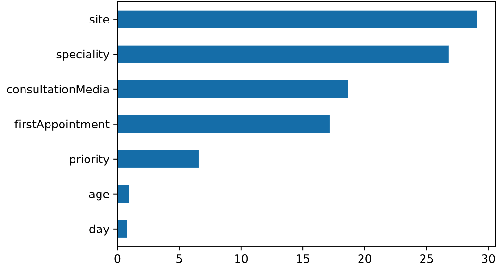
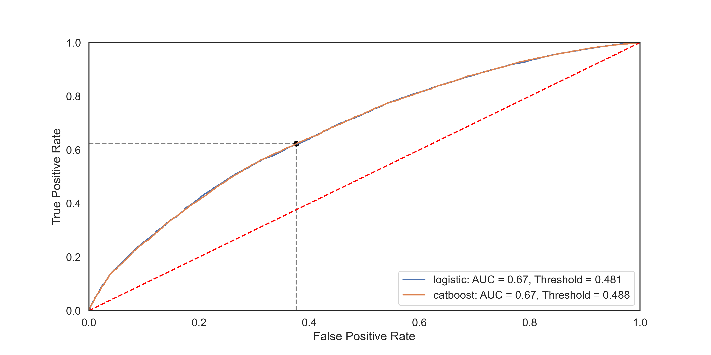
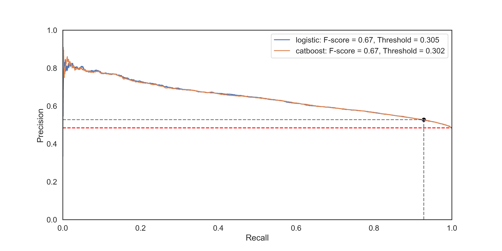
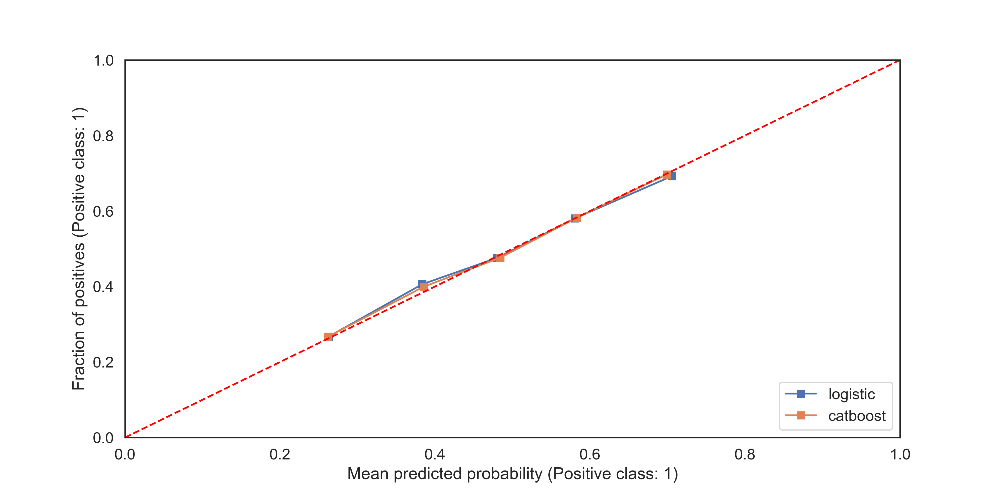

#### Feature Importance

```python
featureImportances = test.getFeatureImportance(models['catboost']['model'])
fig = featureImportances.plot.barh()
fig.figure.savefig('featureImportances.png')
```


<p align="center">
    
</p>
<br> *Figure 1: Feature Importances.*

## ROC Curve

```python
fig, ax = test.plotROC(models, data)
fig.figure.savefig('ROCcurve.png')
```

<p align="center">
    
</p>
<br> *Figure 2: Receiver Operating Characteristic curve for both CatBoost and Logistic Model.*

## Precision-Recall Curve

```python
fig, ax = test.plotPrecisionRecall(models, data)
fig.figure.savefig('PRcurve.png', dpi=300)
```

<p align="center">
    
</p>
<br> *Figure 3: Precision-Recall curve for both CatBoost and Logistic Model.*


## Calibration Curve

```python
fig, ax = test.plotCalibrationCurve(models, data, strategy='quantile')
fig.figure.savefig('CalibrationCurve.png')
```

<p align="center">
    
</p>
<br> *Figure 4: Calibration curve for both CatBoost and Logistic Model.*


## Evaluation Report
The `evaluate()` function computes a comprehensive set of performance metrics using the `test` data.

```python
report = test.evaluate(models['catboost']['model'], data)

print(report)
{
    'Attend': {
        'precision': 0.7976354138025845,
        'recall':    0.7815193965517241,
        'f1-score':  0.7894951694108042,
        'support':   3712
    },
    'DNA': {
        'precision': 0.7901138716356108,
        'recall':    0.8057534969648984,
        'f1-score':  0.7978570495230629,
        'support':   3789
    },
    'accuracy':      0.7937608318890814,
    'macro avg': {
        'precision': 0.7938746427190977,
        'recall':    0.7936364467583112,
        'f1-score':  0.7936761094669336,
        'support':   7501
    },
    'weighted avg': {
        'precision': 0.7938360372833652,
        'recall':    0.7937608318890814,
        'f1-score':  0.7937190280623637,
        'support':   7501
    }
}
```
