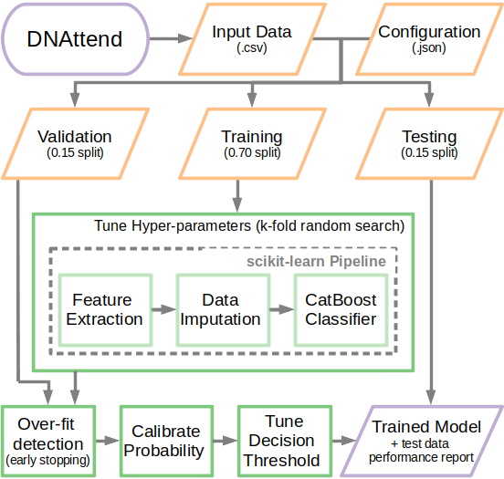

# DNAttend - ML framework for predicting patient non-attendance

**This model is not currently suitable for predicting patient non-attendance in a real-world healthcare environment.**

**Note**: *All example data used in this repository is simulated and for illustrative purposes only.*

See code `README` for installation and usage instructions. 

## Overview

A CatBoost Classifier for predicting patient non-attendance (DNA).

DNAttend trains two models independently; a baseline logistic regression model and a CatBoost model.
The CatBoost model is trained via a cross-validated randomised hyper-parameter search with over-fit detection.
In addition, over-fit detection is performed using a holdout validation set to determine the optimal boosting iterations. Output probability of both models are calibrated via cross-validation.

Finally, decision thresholds are tuned, using the training dataset, to optimise either the ROC or F1 score.
This choice of threshold metric is determined by the `tuneThresholdBy` option of the configuration file (defult = f1).

    

   *Figure: Overview of DNAttend workflow*

